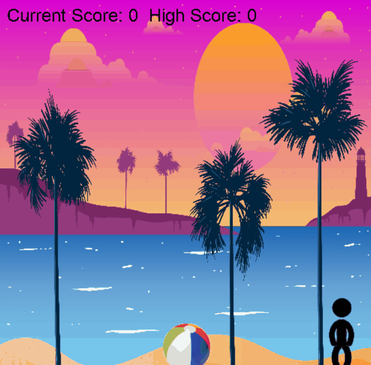

# SDL2 Ballgame
A C++ game using the SDL2 library to animate a player sprite with walking and running modes to hit a ball into the sky.

Left-click: Hit
Space: Lob (reset score)

## Features
- Smooth Player and Ball animations
- Score keeping for added competitiveness
- Pleasing graphical content and backgrounds
- Utilizes SDL2 for graphics rendering

## Dependencies
- SDL2
- SDL2 GFX
- SDL2 TTF

## Demo
